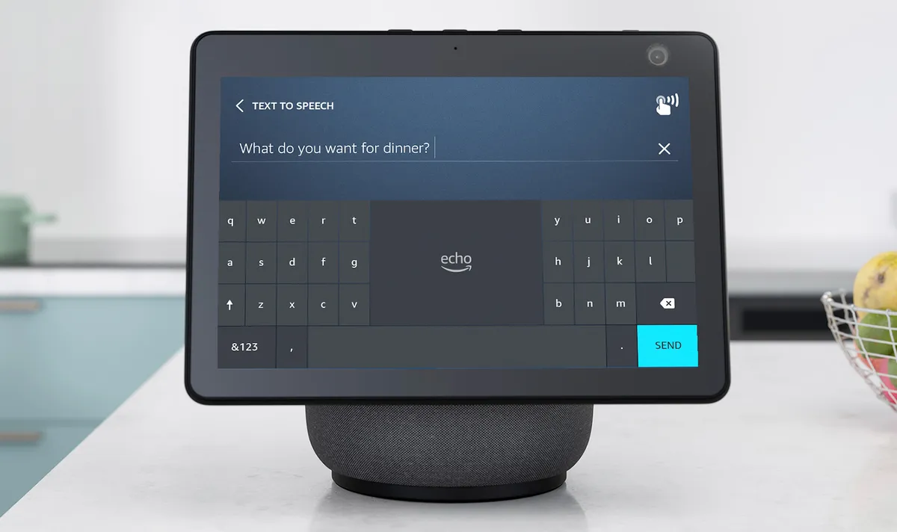

# Functional Specifications

---
**Title:** PAM Assist Mindful

**Author:** Mathias DELILLE

**Created on:** March 12th, 2025

**Last updated:** March 25th, 2025

---

Table of Contents (Click to expand)

- [Functional Specifications](#functional-specifications)
  - [Preamble](#preamble)
  - [1. Introduction](#1-introduction)
    - [1.1 Project Overview](#11-project-overview)
    - [1.2 Project Definition](#12-project-definition)
      - [1.2.1 Vision](#121-vision)
      - [1.2.2 Scope](#122-scope)
      - [1.2.3 Deliverables](#123-deliverables)
    - [1.3 Project Timeline](#13-project-timeline)
      - [1.3.1 Retro-Planning](#131-retro-planning)
      - [1.3.2 Milestones](#132-milestones)
      - [1.3.3 Resources](#133-resources)
      - [1.3.4 Assumptions and Constraints](#134-assumptions-and-constraints)
  - [2. Target Audience](#2-target-audience)
    - [2.1 Target Audience](#21-target-audience)
    - [2.2 User Personas](#22-user-personas)
      - [2.2.1 Enzo Williams - 78 years old](#221-enzo-williams---78-years-old)
      - [2.2.2 Sarah Chen - 45 years old](#222-sarah-chen---45-years-old)
      - [2.2.3 John Marlow - 35 years old](#223-john-marlow---35-years-old)
    - [2.3 Use Cases List](#23-use-cases-list)
    - [2.4 Use Case Descriptions](#24-use-case-descriptions)
      - [2.4.1 Real-Time Transcription](#241-real-time-transcription)
      - [2.4.2 Speaker Identification](#242-speaker-identification)
      - [2.4.3 Accessibility Optimization](#243-accessibility-optimization)
  - [3. UI/UX](#3-uiux)
    - [3.1 Inspiration](#31-inspiration)
      - [Alexa Text to Speech](#alexa-text-to-speech)
    - [3.2 Design Principles](#32-design-principles)
    - [3.3 Logo](#33-logo)
  - [4. Functional Requirements](#4-functional-requirements)
    - [4.1 Navigation and Mobility](#41-navigation-and-mobility)
    - [4.2 Medication Reminders](#42-medication-reminders)
    - [4.3 Conversation Transcription](#43-conversation-transcription)
    - [4.4 Battery Management](#44-battery-management)
  - [5. Non-Functional Requirements](#5-non-functional-requirements)
    - [5.1 Reliability](#51-reliability)
    - [5.2 Performance](#52-performance)
    - [5.3 Maintainability](#53-maintainability)
  - [6. Future Improvements](#6-future-improvements)
    - [6.1 Enhanced Voice Recognition](#61-enhanced-voice-recognition)
    - [6.2 Portable Power Option](#62-portable-power-option)
    - [6.3 Wireless Connectivity](#63-wireless-connectivity)
    - [6.4 Touchscreen Display](#64-touchscreen-display)
    - [6.5 Customizable Accessibility Features](#65-customizable-accessibility-features)
    - [6.6 Integration with Smart Home Systems](#66-integration-with-smart-home-systems)
    - [6.7 Data Logging and Analytics](#67-data-logging-and-analytics)
  - [7. End Matter](#7-end-matter)
    - [7.1 Naming Inspiration](#71-naming-inspiration)
    - [7.2 License](#72-license)
  - [Physical Specifications](#physical-specifications)
    - [Final Product](#final-product)
    - [Prototype](#prototype)

## Preamble

*This document outlines the functional specifications for PAM Assist Mindful (PAM), a single-device robotic assistant designed to transcribe conversations in real-time for elderly users. PAM aims to enhance communication and accessibility through its omnidirectional microphone and integrated display.*

## 1. Introduction

### 1.1 Project Overview

PAM Assist Mindful (PAM) is a compact, user-friendly device designed to improve communication for elderly individuals. Equipped with an omnidirectional microphone and a high-resolution display, PAM transcribes conversations in real-time, enabling users with hearing impairments to follow discussions effortlessly. The device is intended to foster inclusivity, independence, and accessibility in daily interactions.

### 1.2 Project Definition

#### 1.2.1 Vision

The vision of this project is to create a reliable and accessible device that bridges communication gaps for elderly individuals with hearing impairments.

Objectives include:

- Providing real-time conversation transcription to enhance communication.
- Ensuring the device is intuitive and easy to use for elderly users.
- Promoting inclusivity and accessibility in social interactions.
- Maintaining a compact and aesthetically pleasing design.
- Leveraging advanced voice recognition technology for accuracy.

#### 1.2.2 Scope

This project will focus on the following technologies and methodologies:

- **Voice Recognition**: Real-time transcription of conversations using an omnidirectional microphone.
- **Display Technology**: High-resolution screen for clear and readable text output.
- **Human-Centered Design**: Prioritizing usability and accessibility for elderly users.
- **Standalone Device**: Self-contained hardware requiring minimal setup.

#### 1.2.3 Deliverables

| Deliverable               | Purpose                                                    | Document                         |
| ------------------------- | ---------------------------------------------------------- | -------------------------------- |
| Functional Specifications | Define the features and capabilities of PAM.               | [🔗](functionalSpecifications.md) |
| Technical Specifications  | Define the technical requirements and capabilities of PAM. | [🔗](technicalSpecifications.md)  |
| Test Plan                 | Outline the testing procedures and criteria for PAM.       | [🔗](testPlan.md)                 |
| 3D Model                  | Visual representation of PAM's design and dimensions.      | [🔗](../3d/)                      |
| Source Code               | Implementation of PAM's software and algorithms.           | [🔗](../src/)                     |
| User Manual               | Guide for users on how to interact with PAM.               | [🔗](userManual.md)               |

### 1.3 Project Timeline

#### 1.3.1 Retro-Planning

The project will be developed on 22 months, from 27 November 2024 to 29 May 2026.

#### 1.3.2 Milestones

| Date             | Milestone                                   |
| ---------------- | ------------------------------------------- |
| 27 November 2024 | Project Kickoff                             |
| 13 December 2024 | Definition of Necessary Components and cost |
| 16 December 2024 | Components Order                            |
| 16 January 2025  | End of Components Individual Testing        |
| 5 February 2025  | Functional Specifications Completed         |
| 26 February 2025 | Technical Specifications Completed          |
| 18 March 2025    | Test Plan Completed                         |
| 17 April 2025    | 3D Model Completed                          |
| 15 May 2025      | Hardware Assembly Completed                 |
| 12 June 2025     | Software Implementation V1 Completed        |
| 26 June 2025     | User Manual Completed                       |
| 7 July 2025      | Begin of the Test Phase                     |
| 3 December 2025  | Test Phase End                              |
| 17 December 2025 | Improvements Based on Feedbacks Begin       |
| 29 May 2026      | Project V2 Completion                       |

#### 1.3.3 Resources

- Single Developer
- Student Budget (Limited)
- Open-Source Technologies (Tools, Libraries, Frameworks)
- Estimate time based on 2 afternoons dedicated to the project per week (3 hours each): **468 hours** (78 weeks x 2 days/weeks x 3 hours/day = 468 hours)
  - **V1: 180 hours** (30 weeks x 2 days/weeks x 3 hours/day = 180 hours)
  - **V2: 276 hours** (46 weeks x 2 days/weeks x 3 hours/day = 276 hours)
  - **Vacation: 12 hours** (2 weeks x 2 days/weeks x 3 hours/day = 12 hours)
  - **Total Time: 456 hours** (180 hours + 276 hours = 456 hours)

#### 1.3.4 Assumptions and Constraints

- Budget constraints for components and materials.
- Time constraints due to balancing academic commitments and a part-time job.
- Limited experience with robotics and AI development.
- Reliance on open-source tools and resources for development.
- Potential delays due to unforeseen circumstances or technical challenges.
- Restricted testing environment and resources for comprehensive validation.
- Limited access to specialized equipment and facilities for prototyping and testing.
- Insufficient support for hardware and software integration due to individual development.

---

## 2. Target Audience

### 2.1 Target Audience

The target audience for this project includes:

- **Elderly Individuals**: Those with hearing impairments who require assistance in following conversations.
- **Caregivers**: Family members and healthcare professionals seeking tools to improve communication with elderly individuals.
- **Healthcare Providers**: Institutions interested in integrating assistive technologies into elderly care.

### 2.2 User Personas

#### 2.2.1 Enzo Williams - 78 years old

**Background:**

Enzo is a 78-year-old retired teacher who lives alone in a suburban home. He has moderate hearing loss, which makes it difficult for him to follow conversations, especially in group settings.

**Goals:**

- Follow conversations without needing others to raise their voices.
- Maintain independence in social interactions.
- Stay connected with family and friends.

**Frustrations:**

- Difficulty understanding conversations in noisy environments.
- Feeling excluded during group discussions.
- Struggling to adapt to complex technology.

#### 2.2.2 Sarah Chen - 45 years old

**Background:**

Sarah is a 45-year-old nurse who cares for her elderly mother with hearing impairments. She is looking for a solution to help her mother stay engaged in conversations without requiring constant assistance.

**Goals:**

- Provide her mother with a tool to follow conversations independently.
- Reduce the need for repeated explanations during discussions.
- Balance caregiving responsibilities with her professional life.

**Frustrations:**

- Limited availability of simple, effective assistive devices.
- Concerns about her mother feeling isolated due to hearing loss.
- Difficulty finding time to research and set up new technologies.

#### 2.2.3 John Marlow - 35 years old

**Background:**

John is a 35-year-old healthcare professional specializing in geriatric care. He is responsible for evaluating and recommending assistive technologies for elderly patients.

**Goals:**

- Identify reliable and user-friendly devices for elderly care.
- Ensure that assistive technologies are accessible and easy to adopt.
- Improve communication between patients and caregivers.

**Frustrations:**

- Lack of affordable, high-quality solutions for hearing impairments.
- Ensuring elderly patients can adapt to new devices.
- Balancing the demands of his role with staying updated on advancements.

---

### 2.3 Use Cases List

| Use Case ID | Use Case Name              | Description                                                                      |
| ----------- | -------------------------- | -------------------------------------------------------------------------------- |
| UC-01       | Real-Time Transcription    | PAM will transcribe conversations in real-time for the user.                     |
| UC-02       | Speaker Identification     | PAM will differentiate speakers and color-code their text.                       |
| UC-03       | Accessibility Optimization | PAM will ensure text is displayed in a clear, readable format for elderly users. |

---

### 2.4 Use Case Descriptions

#### 2.4.1 Real-Time Transcription

| Field         | Description                                                                                                                                                                                                                                                                 |
| ------------- | --------------------------------------------------------------------------------------------------------------------------------------------------------------------------------------------------------------------------------------------------------------------------- |
| Use Case ID   | UC-01                                                                                                                                                                                                                                                                       |
| Use Case Name | Real-Time Transcription                                                                                                                                                                                                                                                     |
| Actors        | PAM, User                                                                                                                                                                                                                                                                   |
| Description   | PAM will transcribe conversations in real-time, displaying the text on its screen.                                                                                                                                                                                          |
| Precondition  | PAM is powered on and operational.                                                                                                                                                                                                                                          |
| Postcondition | PAM provides an accurate transcription of the conversation.                                                                                                                                                                                                                 |
| Main Flow     | 1. PAM captures audio using its omnidirectional microphone.   2. PAM processes the audio data to generate text.   3. PAM displays the transcribed text on its screen in real-time.   4. PAM continuously updates the transcription as the conversation progresses. |

---

#### 2.4.2 Speaker Identification

| Field         | Description                                                                                                                                                                                                                                                |
| ------------- | ---------------------------------------------------------------------------------------------------------------------------------------------------------------------------------------------------------------------------------------------------------- |
| Use Case ID   | UC-02                                                                                                                                                                                                                                                      |
| Use Case Name | Speaker Identification                                                                                                                                                                                                                                     |
| Actors        | PAM, Multiple Users                                                                                                                                                                                                                                        |
| Description   | PAM will identify different speakers in a conversation and color-code their text for clarity.                                                                                                                                                              |
| Precondition  | PAM is powered on and operational.                                                                                                                                                                                                                         |
| Postcondition | PAM displays transcriptions with color-coded text to indicate different speakers.                                                                                                                                                                          |
| Main Flow     | 1. PAM detects audio input from multiple speakers.   2. PAM analyzes voice patterns to differentiate speakers.   3. PAM assigns a unique color to each speaker.   4. PAM displays the transcribed text with the assigned colors for each speaker. |

---

#### 2.4.3 Accessibility Optimization

| Field         | Description                                                                                                                                                                                                                                                                                           |
| ------------- | ----------------------------------------------------------------------------------------------------------------------------------------------------------------------------------------------------------------------------------------------------------------------------------------------------- |
| Use Case ID   | UC-03                                                                                                                                                                                                                                                                                                 |
| Use Case Name | Accessibility Optimization                                                                                                                                                                                                                                                                            |
| Actors        | PAM, User                                                                                                                                                                                                                                                                                             |
| Description   | PAM will ensure that the transcribed text is displayed in a format optimized for elderly users, considering readability and accessibility.                                                                                                                                                            |
| Precondition  | PAM is powered on and operational.                                                                                                                                                                                                                                                                    |
| Postcondition | PAM displays text in a clear, accessible format.                                                                                                                                                                                                                                                      |
| Main Flow     | 1. PAM initializes the display with accessibility settings (e.g., font size, contrast).   2. PAM adjusts text formatting based on user preferences.   3. PAM ensures that the text remains legible under various lighting conditions.   4. PAM allows users to customize settings if needed. |

---

## 3. UI/UX

### 3.1 Inspiration

The design of PAM is inspired by the Alexa Text to Speech device by amazon. The device's user-friendly interface and clear communication methods serve as a model for PAM's design. The goal is to create an intuitive and accessible experience for elderly users, similar to the Alexa device but on the opposite instead of converting text to speech, PAM will convert speech to text.

#### Alexa Text to Speech

### 3.2 Design Principles

- **User-Centered Design**: PAM's design will prioritize user experience, accessibility, and inclusivity.
- **Intuitive Interface**: PAM's interface will be easy to use, understand for elderly users.
- **Clear Communication**: PAM's communication methods will be clear, concise, and effective for conveying information.
- **Adaptive Interaction**: PAM will adapt its interaction style based on user preferences and feedback.
- **Aesthetic Appeal**: PAM's design will be visually appealing, friendly, and non-intimidating for users.

### 3.3 Logo

<!-- TODO: Create a Logo -->

---

## 4. Functional Requirements

### 4.1 Navigation and Mobility

- **Functionality**: PAM will navigate available spaces without colliding with obstacles.
- **Details**: <!-- TODO: Provide detailed specifications for navigation and mobility. -->

### 4.2 Medication Reminders

- **Functionality**: PAM will remind individuals to take their medication.
- **Details**:
  - Integrated pillbox to manage and dispense medication.
  - Based on local time, PAM will be able to reject the access to the pillbox if the pills have already been taken.

### 4.3 Conversation Transcription

- **Functionality**: PAM will provide written transcriptions of oral conversations.
- **Details**:
  - Omnidirectional microphone to capture audio from all directions.
  - High-resolution display for clear text output.
  - Speaker identification with color-coded text for different participants.

### 4.4 Battery Management

- **Functionality**: PAM will monitor and manage its battery usage to ensure continuous operation.
- **Details**:
  - Estimate remaining battery life.
  - Alert the user when the battery is low (20%).
  - Return to the charging station to recharge.
  - Resume normal operation after recharging.

---

## 5. Non-Functional Requirements

### 5.1 Reliability

- **Description**: PAM will be reliable in its performance and operation.
- **Details**:
  - Ensure consistent navigation without collisions.
  - Provide accurate medication reminders.
  - Deliver real-time conversation transcriptions.
  - Maintain sufficient battery charge for continuous operation.

### 5.2 Performance

- **Description**: PAM will deliver high performance and responsiveness.
- **Details**:
  - Real-time navigation and mobility.
  - Timely medication reminders.
  - Accurate conversation transcriptions.
  - Efficient battery management.

### 5.3 Maintainability

- **Description**: PAM will be designed for easy maintenance and updates.
- **Details**:
  - Modular components for quick repairs and replacements.
  - Software updates for improved functionality.
  - Remote diagnostics and troubleshooting.
  - User-friendly maintenance procedures.

---

## 6. Future Improvements

### 6.1 Enhanced Voice Recognition

- **Description**: Improve the accuracy and adaptability of the voice recognition system.
- **Details**:
  - Implement advanced noise-cancellation algorithms to handle noisy environments.
  - Support multiple languages and regional accents for broader accessibility.
  - Enable customization of voice recognition sensitivity based on user preferences.

### 6.2 Portable Power Option

- **Description**: Add a battery-powered option to make PAM portable.
- **Details**:
  - Integrate a rechargeable battery with sufficient capacity for extended use.
  - Provide battery status indicators on the display.
  - Ensure seamless switching between battery and direct power modes.

### 6.3 Wireless Connectivity

- **Description**: Enable wireless connectivity for remote monitoring and updates.
- **Details**:
  - Add Wi-Fi or Bluetooth modules for communication with external devices.
  - Allow remote updates to software and firmware.
  - Enable users to access transcriptions and settings via a companion mobile app.

### 6.4 Touchscreen Display

- **Description**: Upgrade to a touchscreen display for enhanced interactivity.
- **Details**:
  - Allow users to interact directly with the display for customization and navigation.
  - Provide options to adjust font size, color, and contrast through touch controls.
  - Include a simple, intuitive interface tailored for elderly users.

### 6.5 Customizable Accessibility Features

- **Description**: Expand accessibility options to meet diverse user needs.
- **Details**:
  - Add support for visual impairments, such as text-to-speech for transcriptions.
  - Include adjustable font sizes, high-contrast modes, and colorblind-friendly palettes.
  - Allow users to save and load personalized accessibility profiles.

### 6.6 Integration with Smart Home Systems

- **Description**: Enable PAM to integrate with existing smart home ecosystems.
- **Details**:
  - Provide compatibility with popular smart home platforms (e.g., Alexa, Google Home).
  - Allow PAM to act as a hub for managing smart devices.
  - Enable voice commands to control smart home features, such as lighting and temperature.

### 6.7 Data Logging and Analytics

- **Description**: Add features for logging and analyzing conversation data.
- **Details**:
  - Allow users to save transcriptions for future reference.
  - Provide analytics on conversation patterns, such as speaker activity and duration.
  - Ensure all data is stored securely and complies with privacy regulations.

---

## 7. End Matter

### 7.1 Naming Inspiration

- **PAM Name**: Inspired by [ZWEI](https://en.wikipedia.org/wiki/EINE_and_ZWEI#Naming) recursivity, also known in [GNU](https://en.wikipedia.org/wiki/GNU#Name).

### 7.2 License

<!-- TODO: Define the License to use -->

<!-- TODO: See to integrate these datas -->
## Physical Specifications

### Final Product

- **Height**: Approximately 1.5 meters.
- **Note**: The final product size is intended to provide a significant presence and visibility in the home environment and ensure an easy accessibilty for people that sometime can't bend down.

### Prototype

- **Height**: Approximately 50 centimeters.
- **Note**: The smaller prototype size is intended to significantly reduce costs and 3D printing time.
